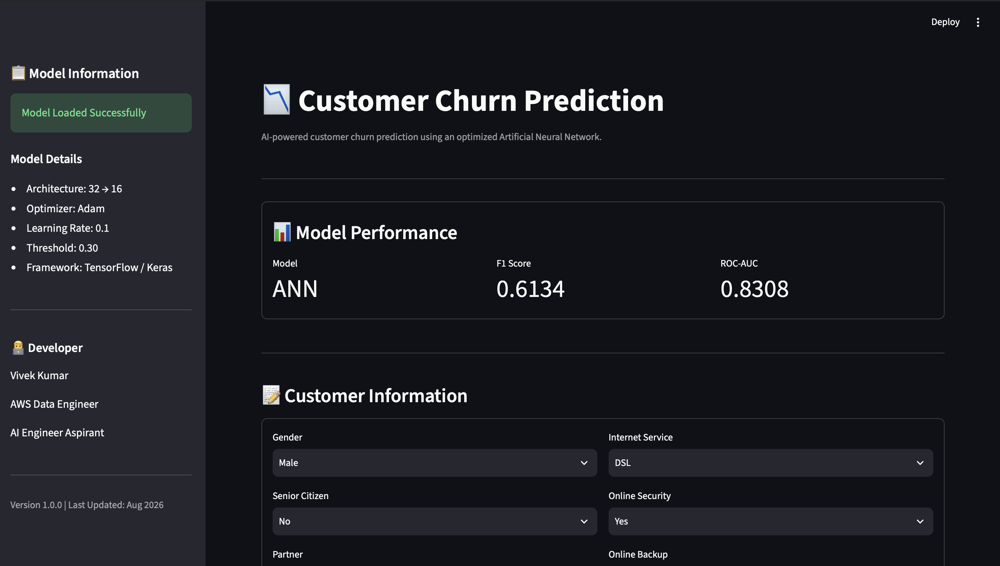
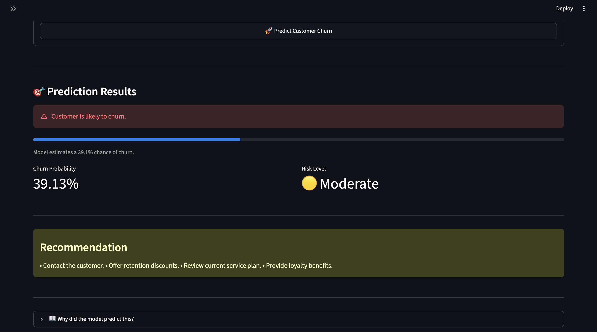
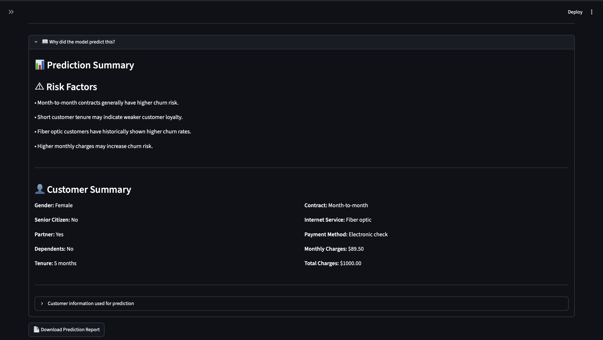

# 📉 Customer Churn Prediction using Artificial Neural Networks

An end-to-end Deep Learning project that predicts customer churn using an optimized Artificial Neural Network (ANN) built with TensorFlow/Keras and deployed with Streamlit.

  [](https://customer-churn-prediction-ann-ai.streamlit.app/) 

## 📚 Table of Contents

- Project Overview
- Live Demo
- Features
- Tech Stack
- Dataset
- Model Performance
- Project Structure
- Installation
- Screenshots
- Future Improvements
- Business Impact
- Author

## 📌 Project Overview

Customer churn prediction is a critical business problem in the telecom industry.

This project predicts whether a customer is likely to churn using an optimized Artificial Neural Network.

The project includes:

- Data preprocessing
- ANN model development
- Hyperparameter optimization
- Production-ready backend
- Streamlit deployment
- Business recommendations

## 🚀 Live Demo

[](https://customer-churn-prediction-ann-ai.streamlit.app/)

## ✨ Features

- End-to-end Deep Learning pipeline
- Optimized ANN model
- Professional Streamlit dashboard
- Customer risk analysis
- Business recommendations
- Downloadable prediction report
- Production-ready modular backend

## 🛠️ Tech Stack

| Category | Technologies |
|----------|--------------|
| **Language** | Python |
| **Deep Learning** | TensorFlow, Keras |
| **Machine Learning** | Scikit-Learn |
| **Data Analysis** | Pandas, NumPy |
| **Data Visualization** | Matplotlib |
| **Frontend** | Streamlit |
| **Version Control** | Git, GitHub |

## 📊 Dataset

Dataset: IBM Telco Customer Churn Dataset

- Total Records: **7,043**
- Total Columns: **21**
- Input Features: **19**
- Target Variable: **Churn**

## 📈 Model Performance

The final optimized Artificial Neural Network (ANN) was selected based on business-oriented evaluation metrics, prioritizing **Recall** and **F1 Score** for effective customer churn prediction.

| Metric | Baseline ANN | Optimized ANN |
|:--------|------------:|--------------:|
| Accuracy | 0.7946 | 0.7591 |
| Precision | 0.6308 | 0.5342 |
| Recall | 0.5481 | 0.7299 |
| F1 Score | 0.5866 | **0.6134** |
| ROC-AUC | 0.8324 | 0.8308 |
> **Business Note:**  
> The optimized ANN intentionally prioritizes **Recall** and **F1 Score** over raw Accuracy. In customer churn prediction, identifying customers who are likely to leave is more valuable than maximizing overall accuracy. This enables businesses to proactively target at-risk customers with retention strategies.

## 📂 Project Structure

```text
Customer-Churn-Prediction-ANN/
│
├── app/
├── data/
├── models/
├── notebooks/
├── src/
├── screenshots/
├── README.md
├── LICENSE
├── requirements.txt
└── .gitignore
```

## ⚙️ Installation
git clone ...

cd Customer-Churn-Prediction-ANN

pip install -r requirements.txt

## ▶️ Run the Application

```bash
streamlit run app/app.py
```

## 📸 Application Screenshots
### 🏠 Homepage


### 🎯 Prediction Result



### 📊 Prediction Insights




## 🚀 Future Improvements

- Docker support

- REST API deployment

- SHAP explainability

- Cloud deployment

- Database integration

## 👨‍💻 Author

Vivek Kumar

AWS Data Engineer

AI Engineer Aspirant

## 💼 Business Impact

The optimized ANN model focuses on maximizing Recall and F1 Score to identify customers who are at risk of churning.

By identifying potential churners earlier, businesses can:

- Improve customer retention
- Reduce revenue loss
- Prioritize retention campaigns
- Make proactive customer engagement decisions